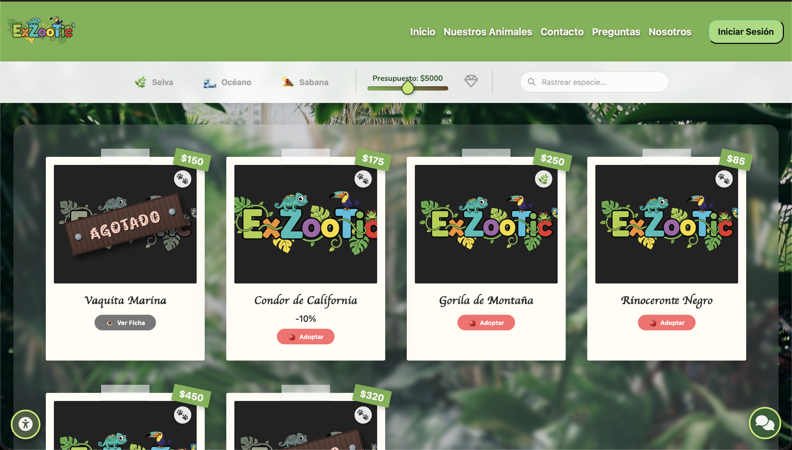
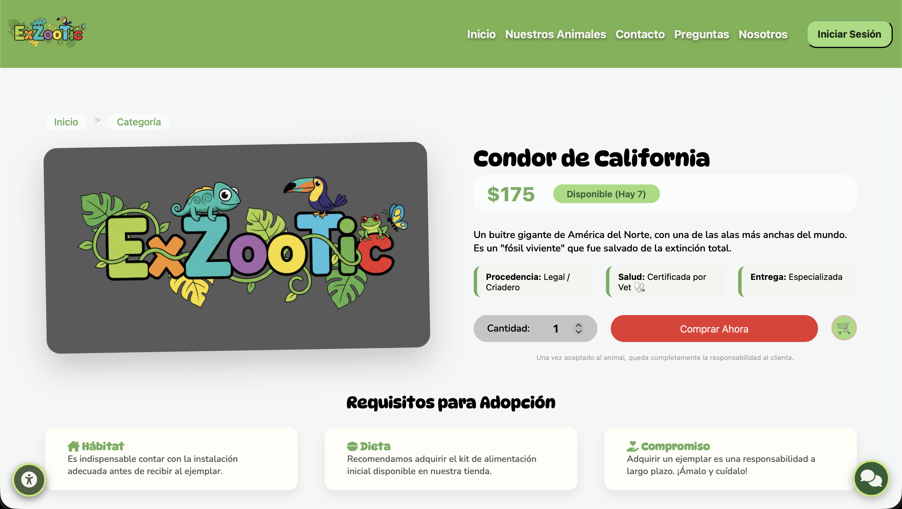

# 🦎 Exzootic

> Plataforma integral de comercio electrónico dedicada a la comercialización ética y gestión de fauna exótica.


## 📖 Descripción del Proyecto

**Exzootic** es una solución tecnológica desarrollada para modernizar el mercado de mascotas no convencionales. El sistema centraliza la oferta de criadores certificados, garantizando la trazabilidad y legalidad de los ejemplares.

El proyecto aborda la problemática de la venta informal mediante una plataforma web segura que gestiona todo el ciclo de venta: desde la publicación del catálogo con fichas técnicas detalladas de cada especie, hasta el procesamiento del pedido y control de inventario en tiempo real.

### ✨ Funcionalidades Clave

* **Catálogo Inteligente:** Buscador avanzado con filtros por precio, tipo de hábitat (desértico, tropical, acuático) y descuento aplicado.
* **Fichas Técnicas:** Vistas detalladas con información sobre alimentación, esperanza de vida y requisitos legales de cada ejemplar.
* **Gestión de Usuarios (RBAC):** Sistema de roles y permisos para Administradores (gestión total) y Clientes.
* **Carrito y Pasarela:** Flujo completo de compra con simulación de transacciones seguras.
* **Dashboard Administrativo:** Visualización de métricas de ventas y reportes de inventario.

## 📸 Capturas de Pantalla

| Landing Page | Detalle de Especie |
|:---:|:---:|
|  |  |
| *Vista principal con productos destacados* | *Información específica del animal* |

## 🛠️ Stack Tecnológico

La arquitectura del sistema se basa en las siguientes tecnologías:

* **Frontend:** HTML5, CSS3, JavaScript
* **Backend:** Node.js
* **Base de Datos:** MySQL
* **Control de Versiones:** Git & GitHub

## 🚀 Instalación y Despliegue

Instrucciones para desplegar el proyecto en un entorno local:

1.  **Clonar el repositorio**
    ```bash
    git clone [https://github.com/santosEmiliano/Ecommerce-API-EquipoExZooTic/branches](https://github.com/SantosEmiliano/exzootic.git)
    ```
2.  **Instalar dependencias**
    ```bash
    npm install
    ```
3.  **Configuración**
    Modificar el archivo .env` y configurar las credenciales de la base de datos.
4.  **Ejecución**
    ```bash
    npm run dev
    ```

## 👥 Equipo de Desarrollo

Proyecto desarrollado por el equipo de ingeniería:

* **[Emiliano Alejandro Santos González]** - *Project Manager & Full Stack Developer*
* **[Harim Jesús Enrique Dueñas Dávila]** - *Full Stack Developer*
* **[José Luis Narváez Martínez]** - *Backend Developer & Database Administrator*
* **[Diana Ruth Gutierrez Márquez]** - *Deployment Manager *
* **[Julián Emmanuel Hernández]** - *Frontend Developer*
* **[Alonso Herrera Benavídez]** - *Frontend Developer & Deployment Manager*
* **[Edson Leonardo Sánchez Montalvo]** - *Full Stack Developer*

---
© 2025 Exzootic Team. Todos los derechos reservados.